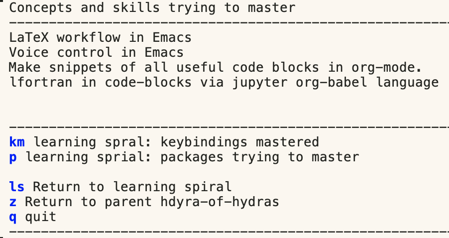

[](https://opensource.org/licenses/MIT)


# Lazy mastery of Emacs with Hydras

## Brief introduction for the impatient
The above `learning-spiral-hydras.el` file supports a lazy approach to mastering key bindings (keyboard shortcuts) in the core of GNU Emacs.
The commands you try to master are listed in multi-part pop-up menus.
I could have mapped these commands to the functions that they represent, but I did not do so to force the manual entry of the key bindings.
This is a learning aid, not a crutch.

The parent pop-up menu is invoked by entering `C-c 1` from any buffer.
Navigate to the child menus by clicking on the blue colored letter.
Each child menu is a separate Hydra.
Feel free to break these Hydras into standalone Hydras.

Menus (Hydras) specific to particular major modes and packages are under development as separate Hydras to minimize the nesting of Hydras.
One child menu exists for LaTeX-mode.

The file is easily edited for customization to meet your needs.
I expect it to be used as a template.
If you are a beginning Emacs user, you can use these lists to jump-start your use of Emacs.

The code blocks and snapshots below show the individual hydras.
The lists of keybindings in these hydras are abbreviated to save space.
The `learning-spiral-hydras.el` contains my current GNU Emacs core hydras, which are more numerous than those in the lists shown below.

Of course, you can access similar information by using the built-in info system.
However, beginners need help with this extensive system. 
The above may Hydras help beginners jump-start using the keybindings, including those that access the info system.

## Longer introduction for the curious
[Hydras](https://github.com/abo-abo/hydra) are popup menus in Emacs--the ultimate text editor that is ``hard to learn but easy to use''.
Hydras demonstrate the highly configurable nature of Emacs.
These pop-up menus are called Hydras because one Hydra popup menu can be used to call many other Hydra popup menus.
However, only one Hydra is displayed at a time.

I use a **Hydras of Hydras** as a port of entry to all my Hydras.
There is no limit to how deeply the Hydras can be nested.
Because of this feature, the analogy with the mythological beast breaks down to the disappointment of those who know their Greek mythology.

Hydras are often associated with a specific Emacs package to ease the use of the functions in that package.
They provide shortcuts in single or multiple letters that can be entered on the keyboard or clicked on with the cursor to invoke the associated function.
In addition to running elisp functions inside Emacs, Hydras can open external applications from inside Emacs, open specific files for editing or reading, and open specific web pages in your default browser.
The latter two features can be done using the bookmarks package built into Emacs's core.                                                                                                                                                                                                                                                                        
The blue-colored letters in the snapshot of the Hydra below are mapped to commands invoked by clicking the letter(s) with the cursor.
Hydras are used to evade learning the corresponding key bindings.

<p align="center"></p>

Here, we take the opposite approach!
We use Hydras's pop-up menu to quickly access a list of Emacs keybindings for which we are trying to build muscle memory.
We are trying to build up muscle memory of the key bindings so that we do not have to recall them when we need to use them.
We open the pop-up menu by entering `C-c 1`.
We can close the Hydra by clicking on it, the **q** button, or entering **q** on the keyboard.

The lazy way of using this list is to invoke it at the start of a work session in Emacs.
We can scan the list as a quick reminder of the keybindings we are trying to master.
A more robust approach would be to set aside several minutes to enter each keybinding we are trying to master five or ten times on the keyboard to build muscle memory.
You would unlikely have time to review the complete list, but this approach is practical when working with 5 to 10 new keybindings daily.
The goal is to build the muscle memory of the key bindings on this list.

After the keybinding is internalized, you can move it to the list of mastered keybindings in another hydra that lists the keybindings you think you have mastered.
The list of mastered key bindings can be reviewed occasionally to ensure you have mastered them.
You invoke this second Hydra by clicking the `km` button: `km` represents `keybindings mastered`.

You can use the Hydras in the above `learning-spiral-hydra.el` file as templates to make additional Hydras.
For example, you might want a Hydra specific to a particular package or major mode with a long list of key bindings you are trying to master.
These related key bindings could be stored in a separate Hydra to reduce the clutter of the master Hydra.

There is a limit to how many key bindings you can display in a Hydra.
The font size and the height of your computer screen impose the limit.
You can only zoom out so far before the font grows too tiny to see.

You can display the keybindings in multiple columns.
I have yet to master setting up multiple columns in an easy way, so I tend to avoid this tactic.
I find it easier to create a second Hydra when there are overflow key bindings.
Just click on `n` to advance to the next section of the list of keybindings.

## History
The Hydras in the above file were inspired by a recent Austin Emacs Meetup discussion where Ag mentioned maintaining a list of keybindings that he was trying to master.
I think he was using an org file to store this list.
I am reducing the friction further by negating the need to navigate to such a file.
You do not have to remember the name or location of that org file.
This can be a problem if there has been a long break from viewing this file.
Just enter `C-c 1` from any buffer to display the master learning spiral Hydra.
The use of the master Hydra has a lower energy barrier than navigating to a text file.


## Related repositories
### Emacs quizzes
A more active means of mastering the keybindings is to take [quizzes](https://github.com/MooersLab/qemacs) about them.
The above PDFs of quiz questions can be printed, and the quiz can be taken when away from the computer.
These quizzes can be taken when you have time to kill, such as standing in the airport boarding line, commuting on public transit, or waiting for a seminar to start.

<!--
Coming Soon:  Interactive Python-based quizzes can be run in the terminal, Jupyter, or Colab notebooks using the `%run` line magic.
A set of quiz questions written in Elisp is also available for running in the minibuffer of Emacs.
You can search for a topic in the quiz question set via the minibuffer.
Coming Soon: I plan to create Hydras that list the questions to ease access to relevant questions related to your task.
-->

### Related Desktop Wallpaper

I made a desktop [wallpaper of common Emacs keybindings](https://codeberg.org/MooersLab/EmacsWallPaper).
Sometimes this is useful to quickly discover what keybindings you have not mastered in Emacs.
It is a more passive and lazier approach.
It might be helpful for some beginners.
You can use it as a template to create your own.


## Installation

Install where you see fit.
My emacs directory (i.e., `~/emacs29`) is not a hidden folder, unlike what is recommended.
I store my Hydras in a subfolder called `my-hydras` (i.e., `~/emacs29/my-hydras`).


```elisp
git clone https://github.com/MooersLab/emacs-learning-spiral-hydra.git
```

### Requirements

Requires the `hydra` package from MELPA.
I also use the `pretty-hydra` package.
I use version 30.0.5 of GNU Emacs on an Intel Mac.
It should work with version 29 of GNU Emacs and perhaps earlier versions of Emacs.


### Configuration

The configuration below is for the users of the `use-package` package system for managing Emacs packages.

- Customize the file path. I store the file `learning-spiral-hydra.el` inside of the folder `~/emacs29/my-hydras/`. I do not use hidden files to store my Emacs configuration.
- Customize the keybinding below if it conflicts. Check by entering `C-h k C-c 1`, where `C` stands for the Control key and the `-` means press the Control key with the second key simultaneously.
- Customize the content of each Hydra to meet your learning objectives.
- Add the following lines to your init.el file. The file my-hydra.el is a master Hydra for calling other Hydras. You do not need it if you only use the emacs-learning-spiral Hydra.

```elisp
(use-package learning-spiral-hydras
  :load-path "~/emacs29/my-hydras/")
(global-set-key (kbd "C-c 1") 'hydra-of-learning-spiral/body)

;;;## reload-init
;; Inspried https://sachachua.com/dotemacs/index.html#org4dd39d0
(defun reload-init ()
  "Reload my init.el file. Edit the path to suite your needs."
  (interactive)
  (load-file "~/emacs29/init.el"))

;;;## reload-hydras
(defun reload-hydras ()
  "Reload my-hydras.el. Edit the path to suite your needs."
  (interactive)
  (load-file "~/emacs29/my-hydras/my-hydras.el"))

;;;## reload-learning-spiral-hydras
(defun reload-learning-spiral-hydras ()
  "Reload learning-spiral-hydras.el. Edit the path to suite your needs."
  (interactive)
  (load-file "~/emacs29/my-hydras/learning-spiral-hydras.el"))
```

#### Caveats
You may have to delete the following line from each Hydra if you lack a master **hydra-of-hydras**.

```elisp
("z" hydra-of-hydras/body :color blue)
```

# Learning spiral hydra
Below is a literate programming document.
It was generated using the `elispdoc` package found [here](https://github.com/benleis1/elispdoc).
This document has been extensively edited subsequently.

This is a nested set of Hydras.
The Hydra at the bottom is the master Hydra: **hydra-of-learning-spiral**.
It has commands for calling the other Hydras above it.

## hydra-of-learning-spiral-concepts-mastered

<p align="center"></p>


This hydra is a to-do list of skills that I am trying to master.
```elisp
(defhydra hydra-of-learning-spiral-concepts-mastered (:hint nil)
"
^Concepts and skills trying to master
-----------------------------------------------------------------------------
LaTeX workflow in Emacs
Voice control in Emacs
Snippets of code blocks in org-mode.

^----------------------------------------------------------------------------
_km_ learning spral: keybindings mastered
_p_ learning sprial: packages trying to master

_ls_ Return to learning spiral
_z_ Return to parent hdyra-of-hydras
_q_ quit
^----------------------------------------------------------------------------
"
("p" hydra-of-learning-spiral-packages-mastered/body :color blue)
("km" hydra-of-learning-spiral-keybindings-mastered/body :color blue)
("ls" hydra-of-learning-spiral/body :color blue)
("z" hydra-of-hydras/body :color blue)
("q" nil :color blue))
```


## hydra-of-learning-spiral-keybindings-mastered

<p align="center"></p>

This hydra in a list of keybindings that I thought I had mastered.
I list these as a reality check and as a reminder after long gaps in the use of these keybindings.

```elisp
(defhydra hydra-of-learning-spiral-keybindings-mastered (:hint nil)
"
^Keybindings and commands mastered
------------------------------------------------------------------------------
C-x C-c                Quit Emacs
C-g                    Abort command entry
C-x C-s                Save file
C-x C-w                Write file
C-x C-f                Open a file
C-x d                  Open dired
C-x C-e                Run elisp sexp
C-c C-e                Export org-mode to another format
C-c C-a                Compile to PDF when in latex-mode or auctex-mode
C-1                    Close buffer
C-x 1                  Display only one buffer
C-c 0                  Display hydra-of-hydras
C-y                    Paste
C-w                    Cut
M-w                    Copy
C-c 0                  Display master hydra
C-c 1                  Display learning spiral hdyra

M-x eval-buffer
M-x reload-hdyra

^------------------------------------------------------------------------------

_c_ learning spiral: concepts trying to master
_p_ learning sprial: packages trying to master

_ls_ Return to learning spiral
_z_ Return to parent hdyra-of-hydras
_q_ quit
^------------------------------------------------------------------------------
"
("c" hydra-of-learning-spiral-concepts-mastered/body :color blue)
("p" hydra-of-learning-spiral-packages-mastered/body :color blue)

("ls" hydra-of-learning-spiral/body :color blue)
("z" hydra-of-hydras/body :color blue)
("q" nil :color blue))
```


## hydra-of-learning-spiral-packages-mastered

<p align="center"></p>

```elisp
(defhydra hydra-of-learning-spiral-packages-mastered (:hint nil)
"
^Packages trying to master
^------------------------------------------------------------------------------

auctex
latex-mode
lsp-grammarly
copilot

^------------------------------------------------------------------------------

_km_ learning spiral: keybindings mastered
_c_ learning spiral: concepts trying to master

_ls_ Return to learning spiral
_z_ Return to parent hdyra-of-hydras
_q_ quit
^------------------------------------------------------------------------------
"
("c" hydra-of-learning-spiral-concepts-mastered/body :color blue)
("p" hydra-of-learning-spiral-packages-mastered/body :color blue)
("km" hydra-of-learning-spiral-keybindings-mastered/body :color blue)

("ls" hydra-of-learning-spiral/body :color blue)
("z" hydra-of-hydras/body :color blue)
("q" nil :color blue))
```


## hydra-of-learning-spiral
This is the master hydra that lists the commands that I am trying to master.
This Hydra also calls several child Hydras that list the following:

- the keybindings that I think I have mastered
- the concepts that I am trying to master
- the packages that I am trying to master

The current version of the list of keybindings to master spans multiple Hydras.
There is a blue-colored letter **n** that you click on to advance to the next hydra in the series.

```elisp
(defhydra hydra-of-learning-spiral (:hint nil)
"
 ^Commands trying to master
 --------------------------------------------------------------------------------------------
 C-c =                 Use in auctex-mode to display the TOC of the document in a separate buffer.
 C-c d                 Display pop-up with info about text file, including the word count.
 C-h l                 Display list of the last commands executed.
 s-,                   Open the customize buffer.
 C-[scrollwheel-up]    Zoom text in.
 C-[scrollwheel-down]  Zoom text out.

 M-x delete-trailing-whitespace
 M-x lsp
 M-x query-replace M-percent sign
 M-x elispdoc-process-elisp-to-doc-buffer


 ^-------------------------------------------------------------------------------------------

 _km_ learning spiral: keybindings mastered
 _c_ learning spiral: concepts trying to master
 _p_ learning spiral: packages trying to master
 _he_ edit /emacs29/my-hydras/my-hydras.el
 _i_  edit init.el
 _ri_ reload init.el
 _rh_ reload hydras
 _z_ Return to parent hdyra-of-hydras
 _q_ quit
 ^------------------------------------------------------------------------------
 "
("c" hydra-of-learning-spiral-concepts-mastered/body :color blue)
("p" hydra-of-learning-spiral-packages-mastered/body :color blue)
("km" hydra-of-learning-spiral-keybindings-mastered/body :color blue)
("he" (find-file "/Users/blaine/emacs29/my-hydras/my-hydras.el") :color blue)
("i"  (find-file "/Users/blaine/emacs29/init.el") :color blue)
("ri" (reload-init) :color blue)
("rh" (reload-hydras) :color blue)
("z" hydra-of-hydras/body :color blue)
("q" nil :color blue))
```

## Funding sources
- NIH: R01 CA242845, R01 AI088011
- NIH: P30 CA225520 (PI: R. Mannel); 
- NIH: P20GM103640 and P30GM145423 (PI: A. West)

## Update history

|Version        | Changes                                                                                                               | Date                |
|:--------------|:----------------------------------------------------------------------------------------------------------------------|:--------------------|
| Version 0.6   |  Added the funding sources and this update table to README.md.  Fixed typos in README.md                              | 2024 April 16       |
| Version 0.6.1 |  Fixed the alignment of this table.  Further edits of the README.md to improve the grammar.                           | 2024 September 7    |


> The first draft of this file was auto-generated by [elispdoc.el](https://github.com/benleis1/elispdoc)
